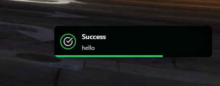

# kNotify: FiveM Notification System

kNotify is just a simple notification system for FiveM. It was originally made for a minigame server I was working on, but I've shelved that project for now. So, I thought why not share this simple thing? :P



## Features

- **Multiple Notification Types**: Support for error, warning, notification, success, information, cash, and custom types.
- **Flexible Positioning**: Place notifications at top, bottom, top-left, top-right, bottom-left, bottom-right, middle-left, or middle-right of the screen.
- **Automatic Stacking**: Identical notifications are grouped together with a count indicator.
- **Progress Bar**: Visual indicator for notification duration.
- **Smooth Animations**: Elegant enter/exit animations for a polished user experience.
- **Sound Support**: Option to play a sound when a notification appears.
- **Custom Icons**: Unique icons for each notification type.
- **Responsive Design**: Clean and responsive UI that adapts to different screen sizes.

## Installation

1. Download the kNotify resource.
2. Place it in your FiveM server's resources folder.
3. Add `ensure kNotify` to your server.cfg file.

## Usage

### Client-Side Usage

```lua
exports['kNotify']:Notify({
    type = "cash",
    title = "Transaction",
    message = "You received $500",
    duration = 3000,
    position = "top",
    playSound = true
})
```

### Server-Side Usage

To send a notification to a specific player from the server:

```lua
TriggerClientEvent('kNotify:addNotifaction', playerId, {
    type = "error",
    title = "Error",
    message = "An error occurred.",
    duration = 5000,
    position = "top-right",
    playSound = true
})
```

### Notification Types

- `error`
- `warning`
- `notification`
- `success`
- `information`
- `cash`
- `custom`

### Position Options

- `top`
- `bottom`
- `top-left`
- `top-right`
- `bottom-left`
- `bottom-right`
- `middle-left`
- `middle-right`

## Important Notes

- Ensure that the `sound.mp3` file is present in the correct directory within the resource for sound functionality.
- This is a standalone resource and does not require any additional frameworks or libraries to function.

For more detailed information on implementation and advanced usage, please refer to the comments within the resource files.